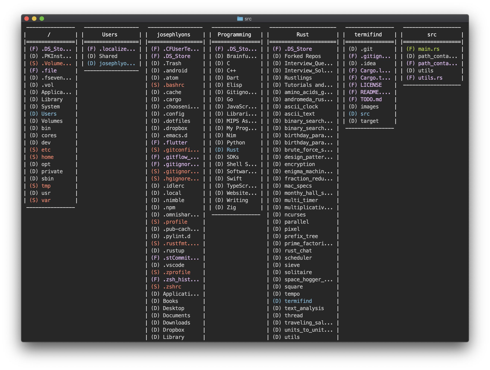
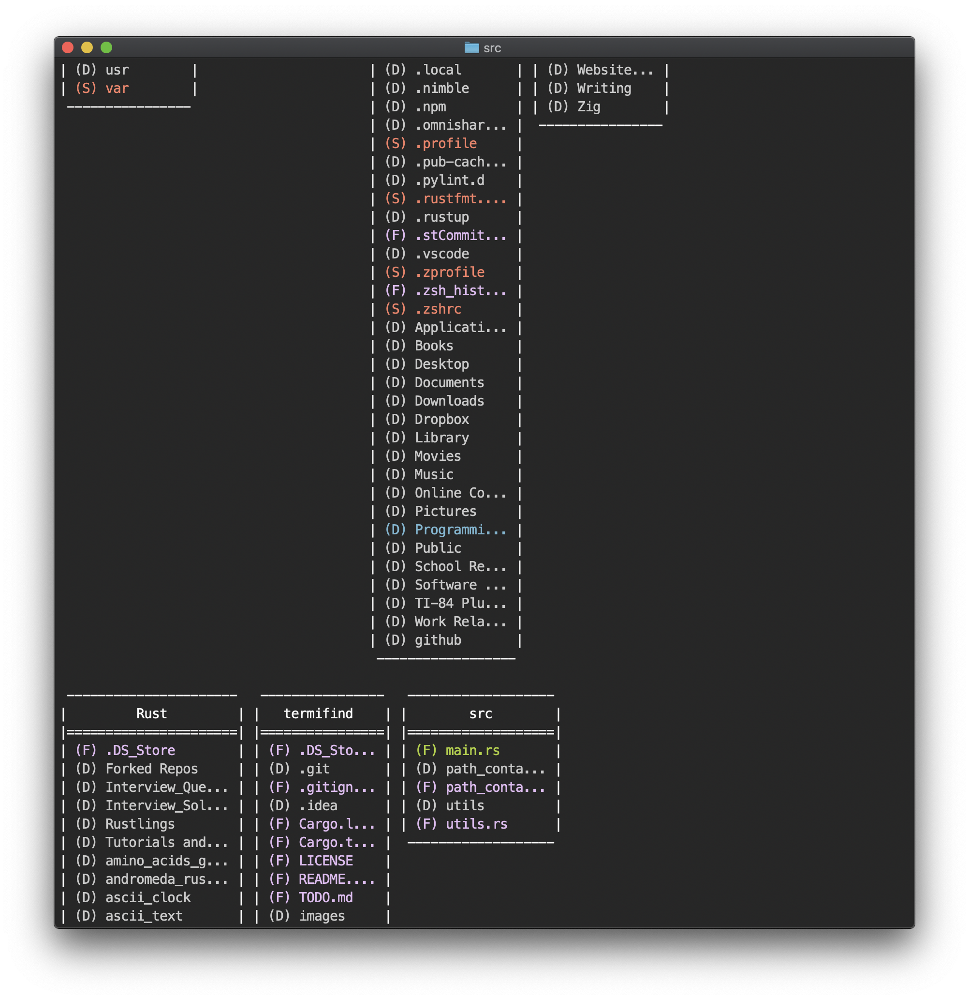
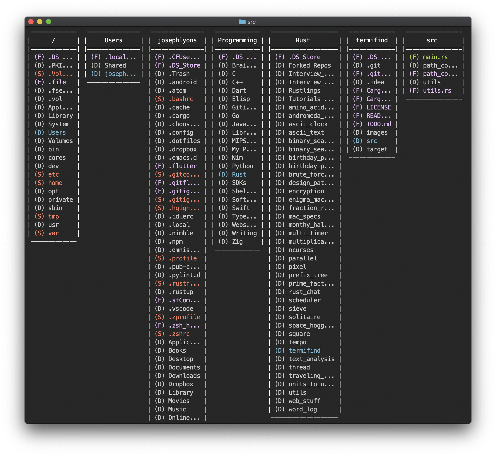
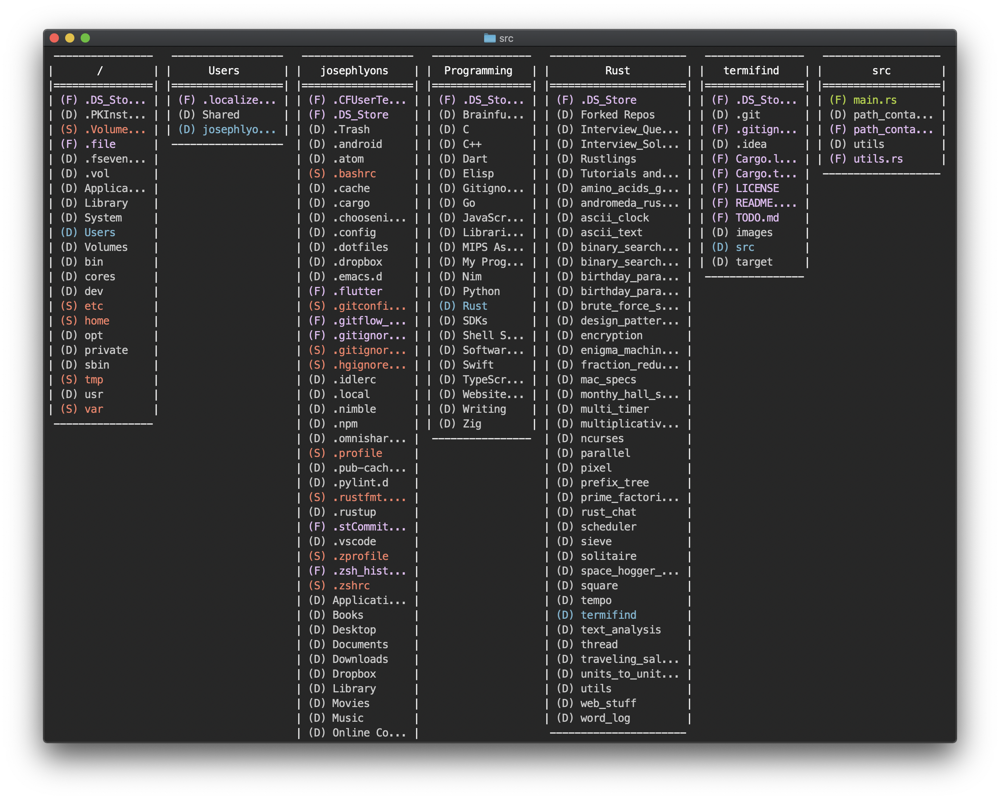

# TermiFind

TermiFind is heavily inspired by the MacOS Finder.  The goal of it is to create
a cross-compatible tool that behaves like Finder within Terminal.  TermiFind is
in its infancy; in its current state, it simply takes the current workin
directory and prints out a structure like this:

It does not accept input, but the ultimate goal would be for TermiFind to be
interactive, allowing you to navigate through the directories, open files in
native applications, or launch applications, but a lot of groundwork needs to be
done first before that task can even begin.

TermiFind will print as many directory containers as it can to the shell window,
but will wrap down to a new line if needed:

TermiFind currently doesn't have a central place for settings, but it is being
developed with flexibility in mind.

## Settings:

### File Truncation:

1. No truncation of file names
2. Truncation of file names by a constant value
3. Truncation of file names by level (link to another area to explain this)
4. Truncation of file names by average file name length
5. Truncation of file names by outlier (truncate outliers) (not implemented)
6.  Truncation of file names in order to fit as many directory containers
  horizontally (not implemented)

Note that the string to denote that a file name has been truncated can be
changed.  The truncation options also allow you to choose if you want to include
this string in with the desired length of the truncated file name or not.  For
example:

Here are two examples of truncation of file name by average file name length.  
We are using `...`to denote file name truncation.

When printing, the length of the final string, including `...` will be that of
the average file length.

When printing, the actual text of the file name will be the length of the
average file name and then the `...` is added on after.

Currently, the directory container's name will overrule the truncation settings;
file names can be truncated to any length, but the container will always be at
least wide enough to print the full container name.

### Look:

- Color coding for directory item types: directories, files, and symlinks
- Color coding for miscellaneous items: directories in current path and
  currently selected folder
- Item type symbols: (D), (F), (S)

## Work to be done

There is a lot of work to be done in order to make TermiFind a useable tool.
Check the GitHub Issues for some things that could be worked on if you are
interested in helping

This README.md file is not comprehensive; more needs to be discussed here.

## Note

- I use Clippy and try to silence all warnings emitted by Clippy
- I run rustfmt on all Rust files
